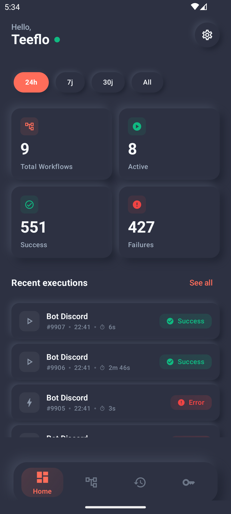
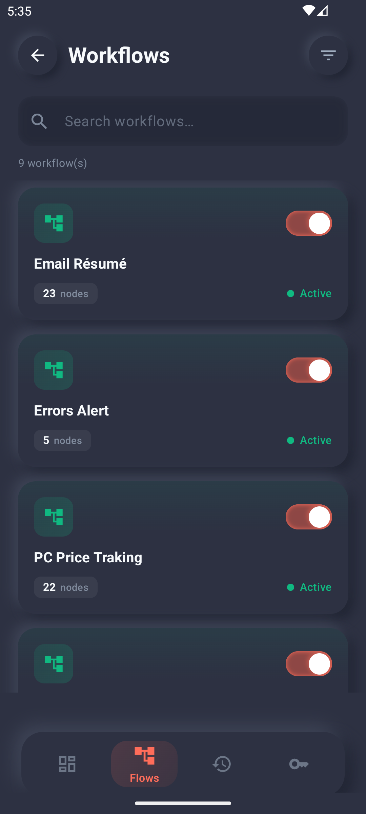
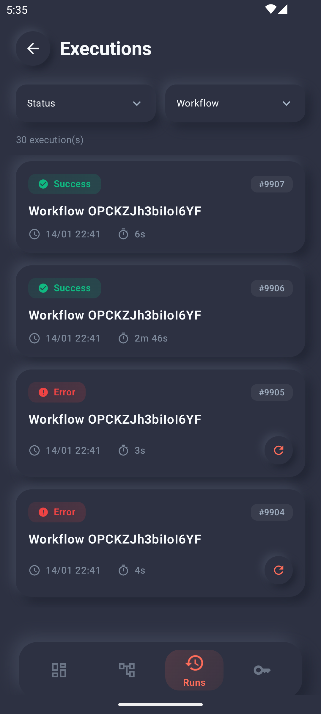

# n8n Mobile Manager 📱

<p align="center">
  <strong>The ultimate companion for your n8n automation server. Manage your workflows, monitor executions, and handle credentials directly from your pocket.</strong>
</p>

<p align="center">
  
  
  
  
</p>

---

## 🚀 Overview

**n8n Mobile Manager** is a cross-platform mobile application designed to provide a seamless management experience for n8n.io users. Built with a modern **Neumorphic UI**, it offers a tactile and intuitive interface to monitor your automation infrastructure on the go.

## ✨ Key Features

- 📊 **Dynamic Dashboard**: Real-time statistics of your instance, including execution success rates and active workflows.
- ⚙️ **Workflow Management**: Toggle workflows on/off, view details, and monitor specific node configurations.
- 🕒 **Execution Tracking**: Detailed history of all workflow runs with error logs and retry capabilities.
- 🔐 **Credential Secure View**: Manage and check your credentials status across multiple instances.
- 🔔 **Push Notifications**: (Android) Get alerted immediately when a workflow fails or requires attention.
- 🌓 **Multi-Instance Support**: Seamlessly switch between different n8n servers.

## 🛠️ Tech Stack

### Android App
- **Language**: [Kotlin](https://kotlinlang.org/)
- **UI Framework**: [Jetpack Compose](https://developer.android.com/jetpack/compose)
- **Architecture**: MVVM with Clean Architecture
- **Dependency Injection**: [Hilt](https://developer.android.com/training/dependency-injection/hilt-android)
- **Local Database**: [Room](https://developer.android.com/training/data-storage/room)
- **Networking**: [Retrofit](https://square.github.io/retrofit/) & OkHttp

### iOS App
- **Language**: [Swift 5](https://swift.org/)
- **UI Framework**: [SwiftUI](https://developer.apple.com/xcode/swiftui/)
- **State Management**: ObservableObjects / Combine

## 📦 Installation

### Android
1. Download the latest `.aab` or `.apk` from the [Releases](https://github.com/Teeflo/n8n-app/releases) section.
2. For development:
   ```bash
   cd android
   ./gradlew assembleDebug
   ```

### iOS
1. Open `ios/n8nMobileManager.xcodeproj` in Xcode.
2. Ensure you have the latest Swift toolchain installed.
3. Build and Run on your simulator or physical device.

## 📸 Preview

| Dashboard | Workflows | Executions |
|:---:|:---:|:---:|
|  |  |  |

## 🛡️ Security

Your data security is paramount:
- On Android, login credentials and n8n API keys are encrypted locally with **Android Keystore**. The app communicates directly with your n8n instance; secrets are not sent to a middle-man service.
- The app communicates directly with your n8n instance; no middle-man servers are involved.

## 📄 License

This project is licensed under the MIT License - see the [LICENSE](LICENSE) file for details.

---
Made with ❤️ for the n8n community.
